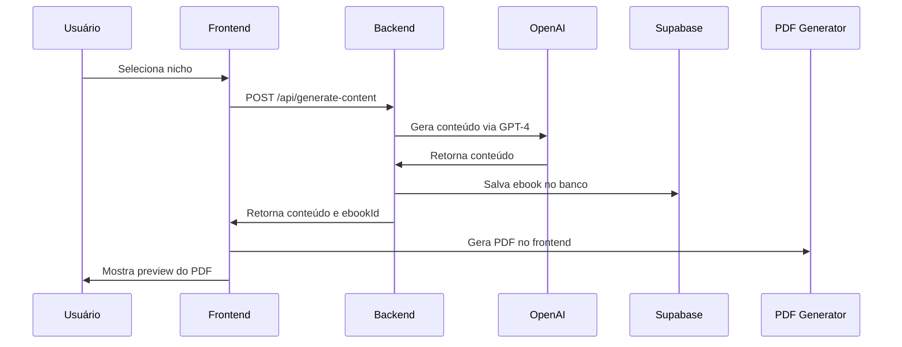
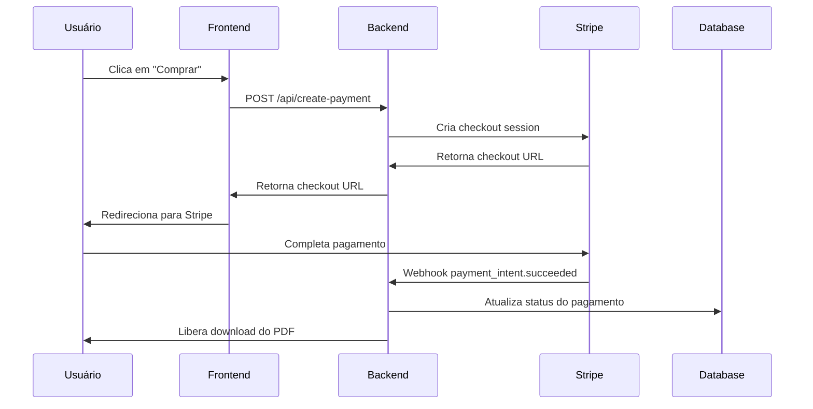

# Arquitetura Técnica - Grana PDF
## Documento de Arquitetura e Infraestrutura

### 1. Visão Geral da Arquitetura

#### 1.1 Princípios Arquiteturais
- **Simplicidade:** MVP focado em funcionalidades essenciais
- **Escalabilidade:** Preparado para crescimento sem refatoração
- **Performance:** Otimizado para geração rápida de PDFs
- **Segurança:** Pagamentos seguros e dados protegidos
- **Confiabilidade:** Sistema resiliente com fallbacks

#### 1.2 Stack Tecnológica
```
Frontend: Next.js 14 (App Router)
Styling: Tailwind CSS
Backend: Next.js API Routes
Database: Supabase (PostgreSQL)
AI: OpenAI API (GPT-4)
PDF: jsPDF
Payments: Stripe
Deploy: Vercel
Storage: Supabase Storage
```

### 2. Arquitetura de Alto Nível

```
┌─────────────────┐    ┌─────────────────┐    ┌─────────────────┐
│   Frontend      │    │   Backend       │    │   External      │
│   (Next.js)     │◄──►│   (API Routes)  │◄──►│   Services      │
│                 │    │                 │    │                 │
│ • Pages         │    │ • Generate      │    │ • OpenAI API    │
│ • Components    │    │ • PDF Creation  │    │ • Stripe API    │
│ • State Mgmt    │    │ • Payment Proc  │    │ • Supabase      │
└─────────────────┘    └─────────────────┘    └─────────────────┘
         │                       │                       │
         └───────────────────────┼───────────────────────┘
                                 │
                    ┌─────────────────┐
                    │   Database      │
                    │   (Supabase)    │
                    │                 │
                    │ • Users         │
                    │ • Ebooks        │
                    │ • Payments      │
                    │ • Storage       │
                    └─────────────────┘
```

### 3. Modelo de Dados

#### 3.1 Schema do Banco de Dados

```sql
-- Tabela de Usuários (opcional para MVP)
CREATE TABLE users (
    id UUID PRIMARY KEY DEFAULT gen_random_uuid(),
    email VARCHAR(255) UNIQUE NOT NULL,
    name VARCHAR(255),
    created_at TIMESTAMP WITH TIME ZONE DEFAULT NOW(),
    updated_at TIMESTAMP WITH TIME ZONE DEFAULT NOW()
);

-- Tabela de Ebooks
CREATE TABLE ebooks (
    id UUID PRIMARY KEY DEFAULT gen_random_uuid(),
    niche VARCHAR(100) NOT NULL,
    title VARCHAR(255) NOT NULL,
    content TEXT NOT NULL,
    pdf_url VARCHAR(500),
    user_id UUID REFERENCES users(id),
    created_at TIMESTAMP WITH TIME ZONE DEFAULT NOW(),
    status VARCHAR(50) DEFAULT 'generated'
);

-- Tabela de Pagamentos
CREATE TABLE payments (
    id UUID PRIMARY KEY DEFAULT gen_random_uuid(),
    stripe_payment_intent_id VARCHAR(255) UNIQUE,
    amount DECIMAL(10,2) NOT NULL,
    currency VARCHAR(3) DEFAULT 'BRL',
    status VARCHAR(50) NOT NULL,
    ebook_id UUID REFERENCES ebooks(id),
    user_id UUID REFERENCES users(id),
    created_at TIMESTAMP WITH TIME ZONE DEFAULT NOW(),
    updated_at TIMESTAMP WITH TIME ZONE DEFAULT NOW()
);

-- Índices para Performance
CREATE INDEX idx_ebooks_user_id ON ebooks(user_id);
CREATE INDEX idx_ebooks_niche ON ebooks(niche);
CREATE INDEX idx_payments_ebook_id ON payments(ebook_id);
CREATE INDEX idx_payments_status ON payments(status);
```

#### 3.2 Relacionamentos
- **User** → **Ebook** (1:N) - Um usuário pode gerar múltiplos ebooks
- **User** → **Payment** (1:N) - Um usuário pode ter múltiplos pagamentos
- **Ebook** → **Payment** (1:1) - Cada ebook tem um pagamento associado

### 4. APIs e Endpoints

#### 4.1 API Routes (Next.js)

```typescript
// /api/generate-content
POST /api/generate-content
{
  "niche": "fitness",
  "userId": "optional"
}
Response: {
  "success": true,
  "content": "markdown content",
  "title": "Título do Ebook",
  "ebookId": "uuid"
}

// /api/create-pdf
POST /api/create-pdf
{
  "content": "markdown content",
  "title": "Título do Ebook",
  "ebookId": "uuid"
}
Response: {
  "success": true,
  "pdfUrl": "https://storage.url/pdf.pdf"
}

// /api/create-payment
POST /api/create-payment
{
  "ebookId": "uuid",
  "userId": "optional"
}
Response: {
  "success": true,
  "checkoutUrl": "https://checkout.stripe.com/..."
}

// /api/webhook/stripe
POST /api/webhook/stripe
{
  "type": "payment_intent.succeeded",
  "data": {...}
}
Response: {
  "success": true
}
```

#### 4.2 Integrações Externas

**OpenAI API:**
```typescript
const openai = new OpenAI({
  apiKey: process.env.OPENAI_API_KEY,
});

const completion = await openai.chat.completions.create({
  model: "gpt-4",
  messages: [
    {
      role: "system",
      content: "Você é um especialista em criar conteúdo educacional..."
    },
    {
      role: "user", 
      content: prompt
    }
  ],
  max_tokens: 4000,
  temperature: 0.7,
});
```

**Stripe API:**
```typescript
const session = await stripe.checkout.sessions.create({
  payment_method_types: ['card', 'pix'],
  line_items: [{
    price_data: {
      currency: 'brl',
      product_data: {
        name: 'Ebook - ' + nicheName,
      },
      unit_amount: 997, // R$ 9,97
    },
    quantity: 1,
  }],
  mode: 'payment',
  success_url: `${process.env.NEXT_PUBLIC_URL}/success?session_id={CHECKOUT_SESSION_ID}`,
  cancel_url: `${process.env.NEXT_PUBLIC_URL}/cancel`,
  metadata: {
    ebookId: ebookId,
    userId: userId
  }
});
```

### 5. Fluxo de Dados Detalhado

#### 5.1 Fluxo de Geração de Ebook



#### 5.2 Fluxo de Pagamento



### 6. Estratégia de Deploy e Infraestrutura

#### 6.1 Ambiente de Desenvolvimento
```bash
# Local Development
npm run dev          # Next.js dev server
npm run build        # Build para produção
npm run start        # Servidor de produção local
```

#### 6.2 Deploy na Vercel
```yaml
# vercel.json
{
  "version": 2,
  "builds": [
    {
      "src": "package.json",
      "use": "@vercel/next"
    }
  ],
  "env": {
    "OPENAI_API_KEY": "@openai-api-key",
    "STRIPE_SECRET_KEY": "@stripe-secret-key",
    "STRIPE_WEBHOOK_SECRET": "@stripe-webhook-secret",
    "SUPABASE_URL": "@supabase-url",
    "SUPABASE_ANON_KEY": "@supabase-anon-key"
  }
}
```

#### 6.3 Variáveis de Ambiente
```env
# OpenAI
OPENAI_API_KEY=sk-...

# Stripe
STRIPE_SECRET_KEY=sk_test_...
STRIPE_PUBLISHABLE_KEY=pk_test_...
STRIPE_WEBHOOK_SECRET=whsec_...

# Supabase
SUPABASE_URL=https://...
SUPABASE_ANON_KEY=eyJ...
SUPABASE_SERVICE_ROLE_KEY=eyJ...

# App
NEXT_PUBLIC_APP_URL=https://grana-pdf.vercel.app
NEXT_PUBLIC_STRIPE_PUBLISHABLE_KEY=pk_test_...
```

### 7. Estratégia de Escalabilidade

#### 7.1 Para MVP (0-1000 usuários/mês)
- **Frontend:** Vercel (auto-escalável)
- **Backend:** Next.js API Routes (serverless)
- **Database:** Supabase (até 500MB gratuitos)
- **Storage:** Supabase Storage (1GB gratuito)
- **Caching:** Vercel Edge Cache

#### 7.2 Para Crescimento (1000+ usuários/mês)
- **CDN:** Vercel Edge Network
- **Database:** Supabase Pro (mais recursos)
- **Queue:** Implementar fila para geração de PDFs
- **Monitoring:** Vercel Analytics + Sentry
- **Caching:** Redis para cache de conteúdo

#### 7.3 Para Escala (10000+ usuários/mês)
- **Microservices:** Separar geração de PDF em serviço dedicado
- **Load Balancer:** Distribuir carga
- **Database:** Sharding ou read replicas
- **Storage:** S3 ou similar para PDFs
- **Monitoring:** APM completo

### 8. Segurança e Compliance

#### 8.1 Segurança de Dados
- **HTTPS:** Forçado em produção
- **CORS:** Configurado adequadamente
- **Rate Limiting:** Proteção contra spam
- **Input Validation:** Sanitização de dados
- **API Keys:** Armazenadas seguramente

#### 8.2 Compliance
- **LGPD:** Política de privacidade
- **PCI DSS:** Stripe cuida da compliance
- **GDPR:** Preparado para usuários europeus

### 9. Monitoramento e Analytics

#### 9.1 Métricas Técnicas
- **Performance:** Tempo de resposta das APIs
- **Uptime:** Disponibilidade do sistema
- **Errors:** Taxa de erro e logs
- **Usage:** Uso de recursos (OpenAI, Stripe)

#### 9.2 Métricas de Negócio
- **Conversão:** Taxa de conversão por nicho
- **Revenue:** Receita por período
- **User Behavior:** Jornada do usuário
- **Content Quality:** Feedback dos usuários

### 10. Backup e Disaster Recovery

#### 10.1 Backup Strategy
- **Database:** Supabase backup automático
- **Code:** GitHub (version control)
- **Environment:** Vercel preview deployments
- **Configuration:** Environment variables versionadas

#### 10.2 Recovery Plan
- **RTO:** 15 minutos (redeploy na Vercel)
- **RPO:** 1 hora (backup do banco)
- **Fallback:** Versão anterior via Git

### 11. Custos Estimados

#### 11.1 MVP (0-1000 usuários/mês)
- **Vercel:** $20/mês (Pro plan)
- **Supabase:** $0/mês (free tier)
- **OpenAI:** ~$50-100/mês
- **Stripe:** 3% das transações
- **Domain:** $10/ano
- **Total:** ~$80-150/mês

#### 11.2 Crescimento (1000+ usuários/mês)
- **Vercel:** $20/mês
- **Supabase:** $25/mês (Pro)
- **OpenAI:** $200-500/mês
- **Stripe:** 3% das transações
- **Monitoring:** $29/mês (Sentry)
- **Total:** ~$300-600/mês

### 12. Roadmap de Implementação

#### Fase 1: MVP (4 semanas)
- [ ] Setup Next.js + Tailwind
- [ ] Integração OpenAI
- [ ] Geração de PDF
- [ ] Integração Stripe
- [ ] Deploy na Vercel
- [ ] Testes básicos

#### Fase 2: Melhorias (2 semanas)
- [ ] Analytics e tracking
- [ ] Otimização de performance
- [ ] Melhorias de UX
- [ ] Testes de usabilidade

#### Fase 3: Escala (4 semanas)
- [ ] Sistema de usuários
- [ ] Dashboard de analytics
- [ ] Templates personalizados
- [ ] Novos nichos

---

**Documento criado em:** Dezembro 2024  
**Versão:** 1.0  
**Próxima revisão:** Após implementação do MVP 