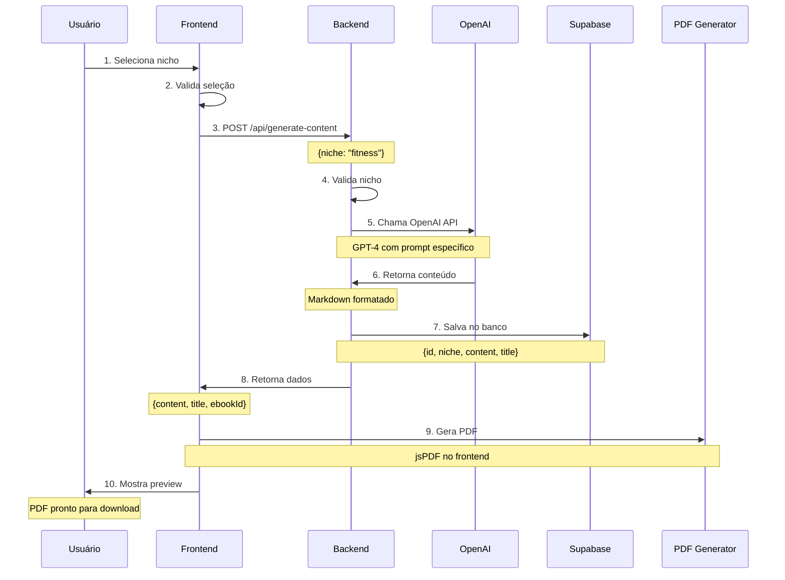
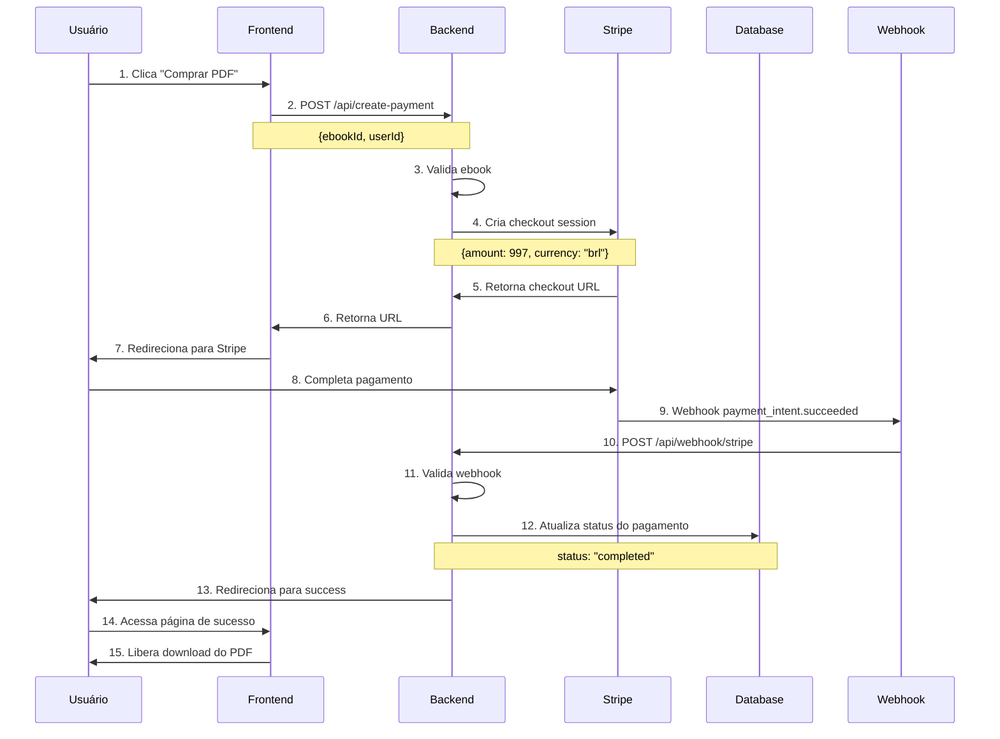
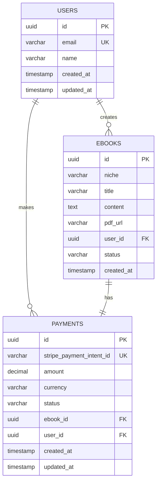
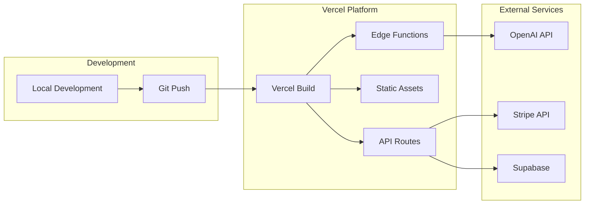
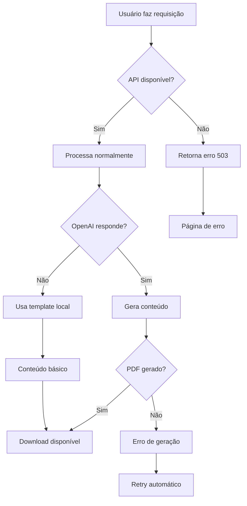
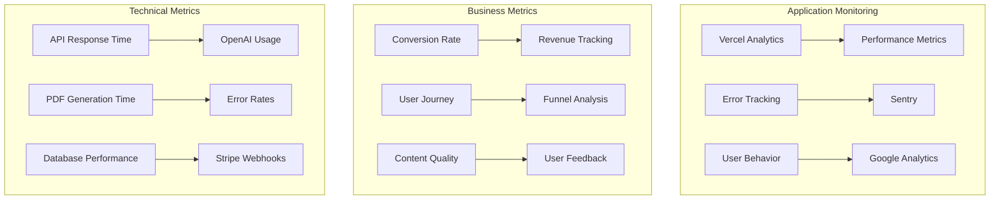

# Diagramas Técnicos - Grana PDF
## Especificações Detalhadas e Fluxos de Implementação

### 1. Arquitetura de Sistema Completa

```mermaid
graph TB
    subgraph "Frontend (Next.js 14)"
        A[Landing Page] --> B[Niche Selector]
        B --> C[Content Generator]
        C --> D[PDF Preview]
        D --> E[Payment Form]
        E --> F[Success Page]
    end
    
    subgraph "Backend (API Routes)"
        G[/api/generate-content] --> H[OpenAI Integration]
        I[/api/create-pdf] --> J[PDF Generation]
        K[/api/create-payment] --> L[Stripe Integration]
        M[/api/webhook/stripe] --> N[Payment Processing]
    end
    
    subgraph "External Services"
        O[OpenAI API]
        P[Stripe API]
        Q[Supabase]
    end
    
    subgraph "Database (Supabase)"
        R[Users Table]
        S[Ebooks Table]
        T[Payments Table]
    end
    
    C --> G
    G --> H
    H --> O
    D --> I
    I --> J
    E --> K
    K --> L
    L --> P
    M --> N
    N --> T
    H --> S
    J --> S
```

### 2. Fluxo de Geração de Conteúdo Detalhado



### 3. Fluxo de Pagamento e Download



### 4. Estrutura de Banco de Dados (ERD)



### 5. Arquitetura de Deploy (Vercel)



### 6. Estratégia de Cache e Performance

```mermaid
graph TB
    subgraph "Client Side"
        A[Browser Cache] --> B[Service Worker]
        B --> C[Local Storage]
    end
    
    subgraph "Edge Cache"
        D[Vercel Edge] --> E[CDN]
        E --> F[Static Assets]
    end
    
    subgraph "Server Side"
        G[API Cache] --> H[Database Cache]
        H --> I[Redis (Future)]
    end
    
    subgraph "External"
        J[OpenAI Cache] --> K[Content Templates]
    end
```

### 7. Fluxo de Erro e Fallbacks



### 8. Especificações de API Detalhadas

#### 8.1 API de Geração de Conteúdo

```typescript
// POST /api/generate-content
interface GenerateContentRequest {
  niche: string;
  userId?: string;
  customTopics?: string[];
}

interface GenerateContentResponse {
  success: boolean;
  content: string;
  title: string;
  ebookId: string;
  error?: string;
}

// Exemplo de uso:
const response = await fetch('/api/generate-content', {
  method: 'POST',
  headers: { 'Content-Type': 'application/json' },
  body: JSON.stringify({
    niche: 'fitness',
    userId: 'optional-uuid'
  })
});
```

#### 8.2 API de Criação de PDF

```typescript
// POST /api/create-pdf
interface CreatePDFRequest {
  content: string;
  title: string;
  ebookId: string;
}

interface CreatePDFResponse {
  success: boolean;
  pdfUrl?: string;
  pdfBlob?: Blob;
  error?: string;
}
```

#### 8.3 API de Pagamento

```typescript
// POST /api/create-payment
interface CreatePaymentRequest {
  ebookId: string;
  userId?: string;
}

interface CreatePaymentResponse {
  success: boolean;
  checkoutUrl: string;
  sessionId: string;
  error?: string;
}
```

### 9. Configuração de Ambiente

#### 9.1 Desenvolvimento Local

```bash
# .env.local
OPENAI_API_KEY=sk-your-openai-key
STRIPE_SECRET_KEY=sk_test_your-stripe-key
STRIPE_PUBLISHABLE_KEY=pk_test_your-stripe-key
STRIPE_WEBHOOK_SECRET=whsec_your-webhook-secret
SUPABASE_URL=https://your-project.supabase.co
SUPABASE_ANON_KEY=your-anon-key
SUPABASE_SERVICE_ROLE_KEY=your-service-role-key
NEXT_PUBLIC_APP_URL=http://localhost:3000
NEXT_PUBLIC_STRIPE_PUBLISHABLE_KEY=pk_test_your-stripe-key
```

#### 9.2 Produção (Vercel)

```bash
# Variáveis de ambiente no Vercel
OPENAI_API_KEY=sk-prod-openai-key
STRIPE_SECRET_KEY=sk_live_stripe-key
STRIPE_PUBLISHABLE_KEY=pk_live_stripe-key
STRIPE_WEBHOOK_SECRET=whsec_live-webhook-secret
SUPABASE_URL=https://prod-project.supabase.co
SUPABASE_ANON_KEY=prod-anon-key
SUPABASE_SERVICE_ROLE_KEY=prod-service-role-key
NEXT_PUBLIC_APP_URL=https://grana-pdf.vercel.app
NEXT_PUBLIC_STRIPE_PUBLISHABLE_KEY=pk_live_stripe-key
```

### 10. Estratégia de Monitoramento



### 11. Plano de Escalabilidade

#### 11.1 Fase 1: MVP (0-100 usuários/mês)
- **Infraestrutura:** Vercel + Supabase Free
- **Custos:** ~$50-100/mês
- **Foco:** Funcionalidade básica

#### 11.2 Fase 2: Crescimento (100-1000 usuários/mês)
- **Infraestrutura:** Vercel Pro + Supabase Pro
- **Custos:** ~$150-300/mês
- **Foco:** Performance e UX

#### 11.3 Fase 3: Escala (1000+ usuários/mês)
- **Infraestrutura:** Microservices + CDN
- **Custos:** ~$500-1000/mês
- **Foco:** Automação e analytics

### 12. Checklist de Implementação

#### 12.1 Setup Inicial
- [ ] Criar projeto Next.js 14
- [ ] Configurar Tailwind CSS
- [ ] Setup Supabase
- [ ] Configurar Stripe
- [ ] Configurar OpenAI

#### 12.2 Desenvolvimento Core
- [ ] Implementar seleção de nicho
- [ ] Integrar OpenAI API
- [ ] Implementar geração de PDF
- [ ] Integrar Stripe checkout
- [ ] Implementar webhooks

#### 12.3 Deploy e Testes
- [ ] Deploy na Vercel
- [ ] Configurar domínio
- [ ] Testes de funcionalidade
- [ ] Testes de pagamento
- [ ] Monitoramento inicial

---

**Documento criado em:** Dezembro 2024  
**Versão:** 1.0  
**Próxima revisão:** Durante implementação 